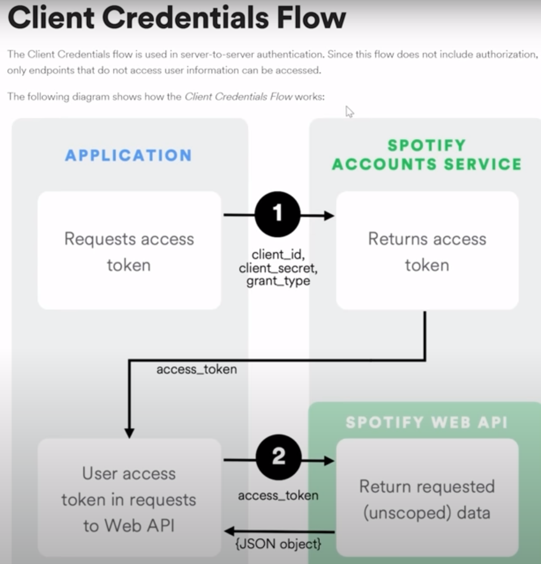

# Projekt-Kaje

#Esmased ideed
    - sauna maksumuse arvutamine
    - rubber ducky andmete varastamiseks
    - ChatGPT-ga ühendatud jurgas
    - krüpto bot
    - PYGAME ON NO-GO
    - enda krüpteeritud chat app
    - to-do list

#potential workload distribution
    -Mihkel uurib kuidas web scrapimine ja andmete kogumine töötab
    -Nurmik uurib andmetöötlust ja algorütme
    -Mihkel uurib GUI ehitamist ja disaini
    -Koos valivad GUI library(PyQt5, Tkinter, Kivy, wxPython, Libavg, PySimpleGUI, PyForms, Wax.)
    -Nurmik uurib kuidas põhiloogika programmil töötama peaks, Mihkel nõustab

#TEEMA
#spotify playlisti soovitused API-ga
    -enda kuulatud laulude puhul soovitused
    -top songs this week
    -vali žanr ja tee sellega top 100 playlist
    -GUI (Tkinter)

#tööjaotus
    -Andmete hanikimine (Mihkel)
    -Andmete töötlus (Nurmik)
    -GUI (Mihkel, Nurmik)

#idee ja eesmärgi lühikirjeldus
Plaan on teha programm, mis kasutab Spotify API ja teeb ülevaate sinu kuulatud muusikast. Lisaks annab ka soovitusi, mida kuulata. Kasutame VSCode, GitHub ja GUI jaoks Tkinter. 

#Kui antud projekt osutub liiga keeruliseks, siis teeme analoogse eelarve haldamise programmi, nagu näites toodud oli.

-----------------------------------------------------
#Selleks, et artisti ID saada, on vaja artisti teada
#Playlisti sisu saamiseks sisesta playlisti nimi